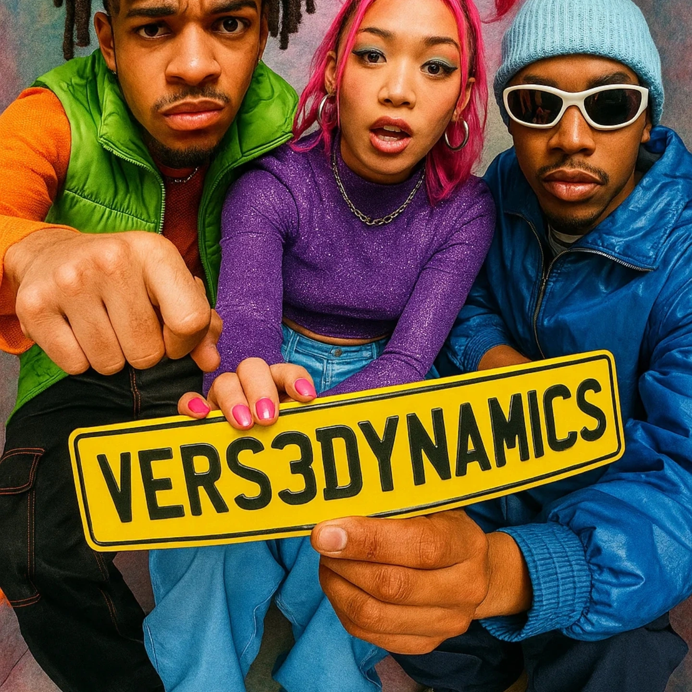

# Vers3Dynamics: Cognitive-Field Engine

A full-spectrum predictive operations platform that integrates chrono-spatial displacement modeling, and adaptive geometric reconfiguration to detect, model, and manipulate non-local phase structures across time, space, and symbolic logic.



## 🚀 Overview

Vers3Dynamics represents the next consciousness-technology integration, providing researchers, analysts, and cognitive scientists with unprecedented apps for exploring the intersection of quantum mechanics, temporal dynamics, and human consciousness.

### Key Capabilities

- **Real-time Quantum Field Visualization** - Interactive particle systems responding to consciousness inputs
- **Dynamic Consciousness Mapping** - Advanced neural state analysis with brainwave synchronization
- **Wormhole Physics Simulation** - DRR-controlled stabilization system with real-time gravitational modeling
- **Temporal Manipulation Engine** - Precise control over time-flow parameters with paradox prevention
- **4D Tensor Lattice Analysis** - Non-Euclidean topology modeling for complex data structures
- **Threat Modeling & Mitigation** - Proactive security analysis for cognitive-field operations
- **Ontological Seed Processing** - Transform abstract concepts into manipulable data structures
- **Mobile-Optimized Interface** - Responsive design for field operations and portable consciousness analysis

## 🧠 Novel Features

### Wormhole Physics Simulator (NEW)
- **DRR-Controlled Stabilization**: Real-time wormhole stability monitoring and control
- **Gravitational Field Visualization**: 3D gravitational well representation with dynamic mass distribution
- **Spacetime Metric Analysis**: Live calculation of curvature tensors and geodesic paths
- **Stability Threshold Management**: Automated systems to prevent catastrophic collapse
- **Multi-dimensional Resonance**: Cross-dimensional field harmonization capabilities

### Quantum Field Visualizer
- **Interactive Particle Systems**: Respond to mouse interaction and consciousness inputs
- **Multiple Visualization Modes**: Particles, waves, and neural network representations
- **Real-time Field Manipulation**: Dynamic intensity controls with quantum coherence tracking
- **Ontological Seed Integration**: Visual representation of processed consciousness data

### Consciousness Mapper
- **Cognitive State Analysis**: Real-time monitoring of awareness, creativity, logic, intuition, and memory
- **Brainwave Synchronization**: Alpha, beta, gamma, and theta wave analysis
- **Neural Plasticity Tracking**: Adaptive learning and consciousness evolution metrics
- **Biometric Integration**: Advanced consciousness-technology interface

### Temporal Manipulator
- **Time Flow Control**: Precise manipulation of temporal flow rates (-2x to 5x)
- **Paradox Prevention**: Advanced algorithms to maintain timeline integrity
- **Causal Loop Detection**: Real-time monitoring of temporal anomalies
- **Chrono-Spatial Coordination**: 4D positioning within the temporal matrix

## 🛠 Technology Stack

- **Frontend**: React 18 + TypeScript
- **Styling**: Tailwind CSS with custom design system
- **UI Components**: Shadcn/ui component library
- **State Management**: Custom hooks with real-time updates
- **Animations**: Canvas-based quantum field simulations
- **Mobile Optimization**: Responsive design with touch-optimized interactions
- **Build Tool**: Vite for optimal performance

## 🚀 Getting Started

### Prerequisites

- Node.js 18+ 
- npm or yarn package manager
- Modern web browser with WebGL support
- Mobile device support: iOS 14+ / Android 8+

### Installation

1. **Clone the repository**
```bash
git clone https://github.com/your-org/vers3dynamics.git
cd vers3dynamics
```

2. **Install dependencies**
```bash
npm install
```

3. **Start the development server**
```bash
npm run dev
```

4. **Open your browser**
```
http://localhost:5173
```

### Production Build

```bash
npm run build
npm run preview
```

## 🎯 Usage Guide

### Basic Operation

1. **Initialize the System**: The interface loads with active quantum field visualization
2. **Stabilize Wormhole**: Use the DRR controls to maintain spacetime stability
3. **Input Ontological Seeds**: Use the consciousness interface to input concepts, emotions, or symbolic data
4. **Monitor Field Dynamics**: Observe real-time changes in the quantum field and tensor lattice
5. **Analyze Consciousness**: Review cognitive state mappings and brainwave patterns
6. **Manipulate Time Flow**: Adjust temporal parameters for advanced analysis

### Advanced Features

#### Wormhole Physics Operations
- **Stability Monitoring**: Real-time tracking of wormhole structural integrity
- **DRR Field Adjustment**: Fine-tune resonance parameters for optimal stability
- **Gravitational Mapping**: Visualize spacetime curvature and mass distribution
- **Emergency Protocols**: Automated shutdown procedures for critical instabilities

#### Mobile Operations
- **Touch Optimization**: Gesture-based controls for field manipulation
- **Responsive Layout**: Adaptive interface scaling for all screen sizes
- **Offline Capabilities**: Local consciousness data processing and analysis
- **Battery Optimization**: Efficient power management for extended field work

## 🔧 Configuration

### Environment Variables

Create a `.env` file in the root directory:

```env
VITE_QUANTUM_FIELD_RESOLUTION=high
VITE_CONSCIOUSNESS_SAMPLING_RATE=100
VITE_TEMPORAL_PRECISION=microsecond
VITE_WORMHOLE_STABILITY_THRESHOLD=85
VITE_DEBUG_MODE=false
```

### Mobile Configuration

Additional mobile-specific settings:

```env
VITE_MOBILE_GESTURE_SENSITIVITY=medium
VITE_TOUCH_FEEDBACK_ENABLED=true
VITE_OFFLINE_MODE_ENABLED=true
```

## 📊 System Requirements

### Minimum Requirements
- **CPU**: Dual-core 2.4GHz
- **RAM**: 4GB
- **GPU**: Integrated graphics with WebGL 2.0
- **Browser**: Chrome 90+, Firefox 88+, Safari 14+
- **Mobile**: iOS 14+ / Android 8+

### Recommended Requirements
- **CPU**: Quad-core 3.0GHz+
- **RAM**: 8GB+
- **GPU**: Dedicated graphics card
- **Browser**: Latest Chrome or Firefox
- **Display**: 1920x1080 minimum, 4K recommended
- **Mobile**: Latest iOS / Android with 6GB+ RAM

## 🔬 Scientific Applications

### Research Use Cases
- **Wormhole Physics**: Study spacetime topology and gravitational field dynamics
- **Consciousness Studies**: Investigate the relationship between awareness states and quantum field fluctuations
- **Temporal Analysis**: Study causal relationships across different time scales
- **Cognitive Enhancement**: Optimize mental states through real-time biofeedback
- **Quantum Psychology**: Explore consciousness-reality interaction models

### Mobile Field Research
- **Portable Consciousness Analysis**: On-site cognitive state monitoring
- **Remote Wormhole Monitoring**: Field-based spacetime stability assessment
- **Emergency Response**: Rapid deployment for temporal anomaly investigation

## 🛡 Security Considerations

### Cognitive Security
- **Consciousness Isolation**: Secure separation of user consciousness data
- **Temporal Integrity**: Prevention of paradox-induced system instabilities
- **Wormhole Containment**: Automated safety protocols for unstable spacetime regions
- **Quantum Encryption**: Field-based data protection algorithms
- **Threat Monitoring**: Real-time security analysis and mitigation

### Mobile Security
- **Encrypted Local Storage**: Secure consciousness data on mobile devices
- **Biometric Authentication**: Fingerprint/face ID for sensitive operations
- **Network Security**: End-to-end encryption for field data transmission

## 🤝 Contributing

We welcome contributors to the Vers3Dynamics project! Please read our contributing guidelines:

### Development Process
1. Fork the repository
2. Create a feature branch (`git checkout -b feature/wormhole-enhancement`)
3. Commit your changes (`git commit -m 'Add wormhole stability algorithms'`)
4. Push to the branch (`git push origin feature/wormhole-enhancement`)
5. Open a Pull Request

### Code Standards
- TypeScript strict mode enabled
- ESLint and Prettier configuration
- Comprehensive unit tests for quantum algorithms
- Mobile-responsive component testing
- Documentation for all consciousness interfaces

## 📚 Documentation

### API Reference
- [Wormhole Physics API](docs/wormhole-physics-api.md)
- [Quantum Field API](docs/quantum-field-api.md)
- [Consciousness Interface](docs/consciousness-interface.md)
- [Temporal Manipulation](docs/temporal-manipulation.md)
- [Mobile Components](docs/mobile-components.md)

## 🌟 Roadmap

### Version 2.0 (Q2 2024)
- [ ] Multi-dimensional consciousness mapping
- [ ] Advanced wormhole traversal protocols
- [ ] Quantum entanglement visualization
- [ ] Collaborative consciousness networks
- [ ] AR/VR mobile interface

### Version 3.0 (Q4 2024)
- [ ] AI-assisted consciousness enhancement
- [ ] Virtual reality quantum field immersion
- [ ] Biological consciousness interface
- [ ] Interdimensional field access
- [ ] Autonomous mobile consciousness units

## 📄 License

This project is licensed under the MIT License - see the [LICENSE.md](LICENSE.md) file for details.

---

**Vers3Dynamics** - *Accelerating the convergence of consciousness and technology*

*"The future of human-computer interaction lies not in better interfaces, but in the direct integration of consciousness with quantum computational systems through stabilized spacetime manipulation."* - Vers3Dynamics Research Team

---

© 2024 Vers3Dynamics. All rights reserved.
